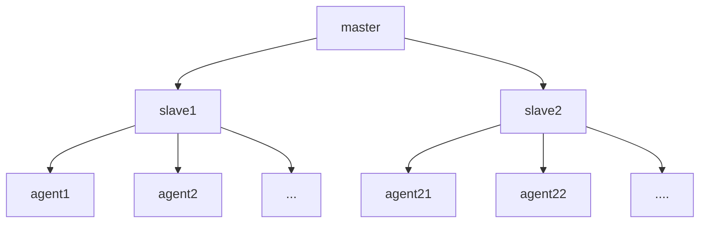

# 多云环境下的部署方法论
## 前言
在现在的各种生产环境中，机器多，多云环境，当应用需要快速平滑上线，持续部署来说相对要复杂些，我这里大概讲一下jenkins使用pipeline实现多云多服务器的方法。整体部署过程中，在完成代码打包后（打成docker镜像后），可以拆分成2步：
1. 分发代码（上传镜像）到node
2. 代码替换(滚动更新)

接下来对这两步进行分开说明

## 一. 代码分发

代码分发的效率主要受以下几个因素的影响：
1. 机器数量多(且可能分布在多云)
2. 代码包大小（镜像大小）
3. 网络环境（国际网络）

整体概括来讲，主要还是受网络影响比较大，针对以上的几个因素，具体的解决方案有：
### 1. 机器数量比较多
可以从以下几个方面进行优化：
* 采用逐层分发结构，即树状结构分发，jenkins中就是采用多slave模式。在每个节点区域都建一个中转站可以有效提高包的分发效率。

* 优化分发工具的效率，比如ansible常用的优化策略有以下几种:
  1. 开启SSH长连接
  2. 开启Pipelining
  3. 开启Accelerate模式
  4. 修改Ansible执行策略，增加fork数量
  5. 任务执行优化，采用异步操作模式
  6. 设置Facts缓存
  7. 添加Mitogen插件

ansible经过优化后可能会有接近10倍的效率提升

### 2. 代码包（镜像）的优化

从运维角度来讲，代码包的大小是无法由运维来控制的，但代码包大小在网络条件比较差的环境下，确实会比较影响代码部署的时间，要进行优化的话，可以从这几个方面入手：
* 寻找更好的网络服务商，保留备选方案。
* 采用增量包的方式进行部署，可以有两种方式拿到增量代码包，一种是测试直接提供补丁包，另一种是自己做好备份，线上的代码包和新的部署包做对比，当然，这个要以公司流程为原则。
* 容易镜像的优化有这两种：
  1. 选择更小的base基础镜像，当然这需要完善的验证后才上生产。
  2. 如果是java代码，JDK的size就有几百M，可以使用挂载node 节点上的固定目录来使用。
  3. 只传输代码到slave节点，然后在slave节点上再使用docker build构建镜像，然后再分发镜像。

当然每种方案都可能会带来一点的风险点，需要具体去分析使用哪种方案，做到即有效率，又不造成生产事故。

### 3. 网络环境不稳定情况下部署

在现有的物理网络不能再有更好的选择情况下，为了提高部署速度和质量，那就是在pipeline里面添加一些容错机制：
 1. 多agent模式，不同云之间的ops机器先上传一份代码，然后这份代码再进行分发，jenkins pipeline的` parallel {}`是执行agent的并发操作
 2. 重试机制，当ansible的playbook执行失败时进行重试，jenkins pepeline中的`retry(5){}`,()中的数据是最多重试次数。
 3. 但如果只是重试会导致正常的机器反复操作，异常的机器可能因为ansible线程太多导致反复出错，所以再加一个逻辑，ansible机器中有一个playbook.retry文件保留执行失败的主机名称，先执行`try{}`正常的代码流程，然后再使用`catch(){retry(5){}}`文件主机重试失败的机器。
 4. 选择适当的时间进行传输，比如到美国的网络，国内白天对应美国的晚上，相对来讲网络质量会稳定很多，所以最好是白天进行传包。

下面的pipeline写了相关的逻辑。
```
//Declarative Pipeline
pipeline {
    agent none
    environment {
        ANSIBLE_FORCE_COLOR=true
        ansible_bin="/bin/ansible-playbook"
        copyfile="/deploy/copy-code-ecs.yml"
        Inven_file="/Inventory/hosts"
        retry_file="/deploy/copy-code-ecs.retry"
    }
    options{
        ansiColor('xterm')
    }      
    stages {
        stage('拷贝代码文件到slave服务器'){
            agent { label 'master' }
            steps{
                script{
                   sh """
                       echo "写代码上传已测试过的代码到各slave服务器huanan_ops，usops上"
                   """                                              
                }
            }
        }         
        stage('slave节点拷贝代码到ecs'){
            parallel {                                                          // 并行操作，节点huanan_ops  和usops同时并行操作
                stage('拷贝-last目录代码到-ECS') {
                    agent { label 'huanan_ops' }
                    steps {
                        script{
                                                         
                            try { 
                                sh"""
                                   rm -f  $retry_file
                                   $ansible_bin  -i $Inven_file $copyfile -f 30 -e "host=$host "
                                """                                
                            }
                            catch(error){
                                def f_host
                                retry(6) {
                                    echo "重试传输失败的主机"
                                    sh"""
                                       if [ -f  $retry_file ]; then
                                            f_host=`cat $retry_file |sed ':label;N;s#\\n#:#;t label'`
                                            $ansible_bin  -i $Inven_file $copyfile -f 30 -e "host=\$f_host "
                                        else
                                            $ansible_bin  -i $Inven_file $copyfile -f 30 -e "host=$host "
                                        fi
                                    """                                     
                                }

                            }
                        }                          
                    }
                }
              
                stage('拷贝-last目录代码到-美西ECS') {
                    agent { label 'usops' }
                    steps {
                        script{
                            def ushost
                                                                                                         
                            retry(5) { 
                                sh"""                                     
                                ushost=`ansible -i \$Inven_file \$host:\\&usa_ser --list|awk 'NR>1{print \$NF}'`
                                if [[ \$ushost != "" ]]; then   
                                                                  
                                   $ansible_bin  -i $Inven_file $copyfile -f 10 -e "host=$host:&usa_ser "
                                fi  
                                """                                
                            }
                        }                         
                    }
                }
            }
        }  
  
    }
}

```

## 二. 持续部署
当代码传输到各节点后，部署就是一个相对稳定的过程，一般定好规范后，逐步执行就Ok了。一般的持续部署包含有几个步骤：
1. 备份代码
2. 逐步替换
3. 状态验证
4. 功能验证
5. 做好回滚策略

在k8s中就简单很多了，yml中定义好直接执行就ok了，只要定义好快速回滚策略就ok了。
