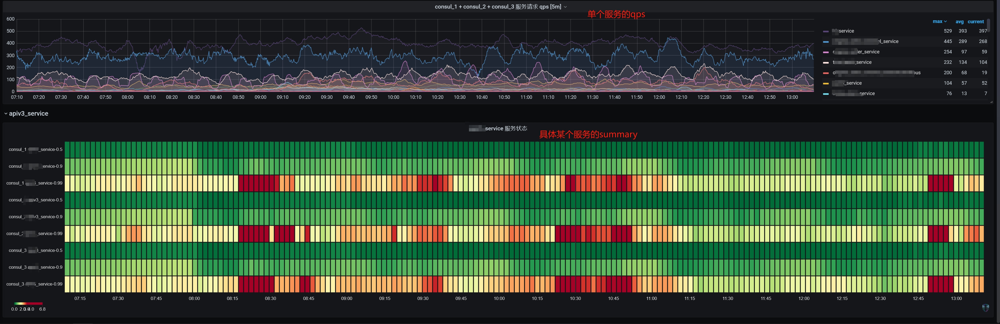
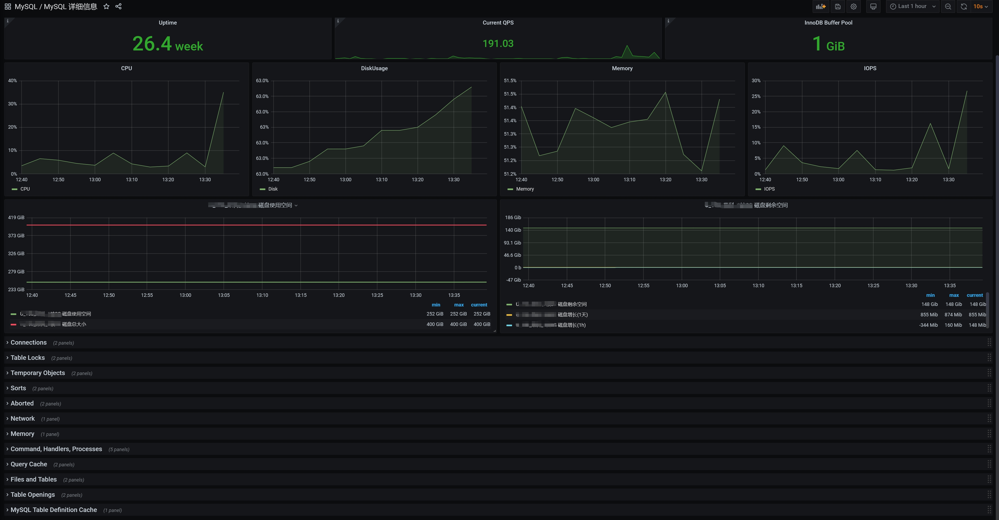

# prometheus 的一些监控思考以及grafana展示效果
## 一 基础监控
### 1. 单台ecs的基础监控
一般常用的ecs系统级别监控项有以下几项：
* CPU核心数
* CPU使用率
* CPU负载
* 内存大小
* 内存使用率
* swap使用率
* 磁盘大小
* 磁盘空间使用率
* 磁盘I/O
* 网络流量（LAN流量/外网流量）
* 系统内核版本
* 系统进程数
* 文件打开数量

这些基本上都可以使用prometheus的node_explorer来获取监控数据，但网络上的内外网流量并不好区分，如果是云上的服务器可以通过云上的api接口获取数据，自建机房可以使用不同网卡来获取流量数据。

**grafana 中的展示效果**

### 2 服务器监控汇总
如果服务器比较多的话，一般会把服务器的基础信息做成表格来展示，并可以根据相关数据进行排序。然后根据相关数据考虑资源情况进行缩扩容操作。

**grafana 中的展示效果**

## 二 黑盒监控
blackbox_exporter可以通过 HTTP、HTTPS、DNS、TCP、ICMP、gRPC对目标进行黑盒探测。并可以在全球不同地点部署，获取网络整体情况，比如国外对国内访问的回源情况进行监控。

**grafana 中的展示效果**

## 三 应用监控
在现在比较流行的k8s中，应用在部署的时候一般就有应用的状态监控以及相应的处理策略，在比较传统的ECS中就需要自己处理应用的状态监控和处理策略了。
根据google的经验，**四个黄金指标**可以在服务级别帮助衡量终端用户体验、服务中断、业务影响等层面的问题。这四种类型的指标是：延迟，通讯量，错误以及饱和度
* 延迟： 服务请求所需时间。重点是要区分成功请求的延迟时间和失败请求的延迟时间；
* 通讯量：监控当前系统的流量，用于衡量服务的容量需求。例如，在HTTP REST API中, 流量通常是每秒HTTP请求数(qps)；
* 错误：监控当前系统所有发生的错误请求，衡量当前系统错误发生的速率；
* 饱和度：衡量当前服务的饱和度。主要强调最能影响服务状态的受限制的资源。如果资源达到饱和后，服务的性能会明显下降，需要根据具体情况扩容，拆分；

**RED方法论**

RED (Request rate, Error rate, and Duration) 方法论是一种监控微服务性能的方法，主要通过监控三个关键指标来评估系统性能：
* 请求速率 (Request rate)：请求速率是指在给定时间内，系统所处理的请求数量。高请求速率可能表示系统面临着巨大的压力，因此需要进一步评估是否需要扩展系统的资源。
* 错误率 (Error rate)：错误率指的是在给定时间内系统请求失败的比率。高错误率可能表示系统出现了问题，因此需要进一步评估系统是否存在故障。
* 请求持续时间 (Duration)：请求持续时间是指请求的处理时间。高请求持续时间可能表示系统处理请求的速度较慢，因此需要进一步评估系统是否需要提高处理效率。

在“4大黄金信号”的原则下，RED方法可以有效的帮助用户衡量云原生以及微服务应用下的用户体验问题。

**USE方法论**

USE (Utilization, Saturation, and Error) 方法论主要用于分析系统性能问题，可以指导用户快速识别资源瓶颈以及错误的方法。正如USE方法的名字所表示的含义，USE方法通过监控三个关键指标来确定系统的性能状况：
* 利用率 (Utilization)：利用率指的是系统的资源利用情况，是衡量系统性能的一个重要指标。利用率过高可能导致系统资源紧张，从而导致系统的性能下降。
* 饱和度 (Saturation)：饱和度指的是系统在特定时间内的资源使用情况，如果系统饱和，即使系统利用率很低，性能也可能下降。
* 错误率 (Error)：错误率是指系统中请求失败的数量。错误率是反映系统是否可靠的一个重要指标，高错误率可能表明系统存在问题，因此需要进行更深入的评估。

使用 USE 方法论，可以监控系统资源的使用情况，以确保系统在正常运行。通过对资源以上指标持续观察，可以知道用户识别资源瓶颈。

下面示例几个常见应用的监控：
#### 1. nginx监控
常见监控项有以下几项：
* 响应码饼图，曲线图
* 缓存率饼图
* QPS
* 活跃连接数
* 出口带宽
* 响应时间
* 请求时间的直方图

**grafana 中的展示效果**

#### 2. redis & 消息队列监控
redis使用场景很多，根据使用场景不同，需要关注的监控项也会有相对的差别，我这里主要是对做为消息队列的监控，而且redis的实例比较多。常用的监控项有：
* 内存占用
* Command 执行次数
* 网络流量
* 未消费队列
* 出列和入列情况
* 连接数
* key的数量及出入列情况
* 命中率

**grafana 中的展示效果**

**多实列汇总情况展示**

#### 3. java应用监控
java应用监控一般有两种方式，一种是在代码里面嵌入监控代码，另一种方式是在启动参数中加入jmx_explorer.jar 暴露端口监控。常用的监控项有：
* GC次数/分
* GC时间/分
* 文件打开数量
* 内存使用
* 线程状态
* 线程使用

#### 4. 中间件fabio + consul 监控
公司的微服务架构采用的是fabio + consul做为服务的注册中心，fabio做为路由转发功能，花了我一些时间做监控，并展示出来。主要监控项有：
* 整体fabio集群的qps，各fabio结点上的qps
* 整体微服务所有请示的状态码饼图
* 整体所有微服务响应时间的汇总
* 所有单个微服务的qps,在曲线图上展示某个具体应用的qps情况
* 具体到某个微服务的响应时间summary图

可以很完善的观察到各服务的调用情况。

**grafana 中的展示效果**

## 四 数据库监控
严格意义上来讲，数据库监控也属于应用监控，只是监控项相对比较多，所以单独列出来
#### 1. 单个数据库的监控
MySQL的监控项很多，对于监控数据来讲，首先做到细，尽可能获取比较有用的监控数据，方便有故障时查询。监控项包括：
* 基础监控，CPU,内存，磁盘，IOPS
* 数据库连接数
* Table Locks
* 临时表监控
* 排序监控
* Aborted监控
* 网络监控
* Top Command Counters
* 文件及表打开监控
* 缓存情况

#### 2. 多实例整体数据库监控汇总
因公司业务情况，数据库实例比较多，所以也对所有的数据库在grafana中做了表格展示处理。

#### 3. 数据库top图
因为业务情况导致实例比较多，所以需要把资源占用情况较多的展示出来，而不用一台台实例去切换查看使用资源情况，这里主要展示一些需要在故障可能造成影响前提前预知的信息：
* 主从复制延迟情况
* 磁盘使用情况，避免假期可能磁盘云RDS磁盘不足情况
* CPU使用率TOP情况
* 内存使用率TOP情况
* IOPS使用率TOP情况

**grafana 中的展示效果**

## 五 多云监控
根据业务场景，公司应用部署在不同环境，如阿里云，华为云，巨石塔，阿里香港节点，美西linode平台，linode UK环境，以及历史原因部署在客户云帐户以及自建机房内，需要把各个地方的监控汇总并集中在一台监控中告警，需要一定的策略和方案，并需要考虑安全因素。常用的方案有：
* push_gateway方案
* 云接口，如华为云的Cloud Eye, 也可以通过云API调用获取数据然后推送的Prometheus
* 80端口转发到目标地址

具体方案需要具体场景分析，存储监控数据现在有比较流行的几种方案，我一般使用的是VictoriaMetrics，另外再谈。

## 六 大盘展示
在业务场景中，为预防告警太频繁，而导致告警无人检验，一般会根据业务情况把告警稍稍延迟或告警降噪，告警收敛，但运维的工作重心应该在预防故障的发生，而不是待故障已经发生后去紧急处理，所以在展示的情况下可以把阈值设置的相对宽松一些，告警的阈值设置得更精准一点。这就是大盘的作用了，在大盘中，可以展示以下信息：
* 应用异常状态，只要应用异常就可以在秒级展示出来，包括黑盒监控中的异常数据。
* 基础监控中的CPU,内存，load top展示
* 消息队列的长度，如果消息队列偏长，可以查看队列消费是否堵塞，或者增加消费者数量
* 数据库基础监控top
* db主从复制异常情况
* db线程并发top
* db锁情况

**grafana 中的展示效果**

## 七 K8S的基础监控
K8S监控，promethus有官方的一套operator，功能完善，只需要根据自己的一些需求去增增减减就ok了，我这里主要展示一下在grafana中的监控数据。主要分为三部分：节点资源总览，微服务(容器名)资源总览，Pod资源总览

### 1.节点资源总览
节点资源指的是k8s中node节点的所有资源，有以下几项：
* 资源使用率，资源请示率，资源Limit
* 节点数，pod数，上限pod，svc
* 网络流量

以上资源的表格和曲线图

**grafana 中的展示效果**

### 2. 微服务(容器名)资源总览
这里的微服务和Pod不是完全等同的，一个pod上可能包含有多个微服务。一个微服务中包括所有docker容器的整体资源。
**grafana 中的展示效果**

### 3. Pod资源总览
pod资源主要监控的是单个pod的资源使用情况，pod 资源使用率，pod 资源请求,pod 资源limit，这三个参数要有相对应的配置，否则会很容易导致pod异常重启。所以根据监控信息具体去调优是比较好的方法。
 **grafana 中的展示效果**

### 4 ingress 监控展示
ingress这里使用的是nginx,和nginx的监控没有太大的差别，在K8s中其他应用的监控和在物理机上应用监控本身没有太大的差别，只是获取监控数据的方式不同，就不再详细介绍了。
 **grafana 中的展示效果**
